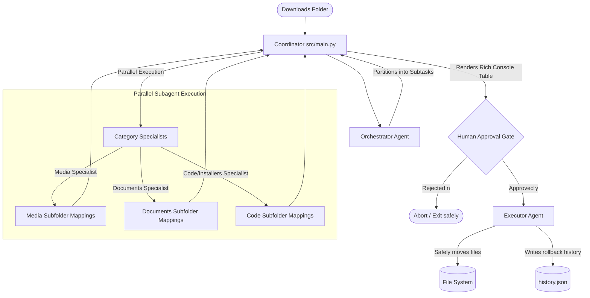

# Local Agent Directory Organizer

A local multi-agent system built using **CrewAI** and **Ollama** that semantically restructures and cleans up cluttered directories (e.g., your `Downloads` folder). 

Instead of basic extension-based sorting (e.g., moving all `.pdf` files into a single generic `Documents/` folder), this system uses LLMs to understand the semantic meaning of filenames and group them into logical, context-aware subfolders (e.g., placing `uber_invoice_2026.pdf` into `Documents/Finance/Receipts/`).

---

## 🏗️ Architecture & Workflow

The system utilizes a hierarchical coordinator-specialist agent architecture to handle large directories without running into LLM context window limits:



---

## 🛠️ Technical Specifications & Features

### 1. Semantic Classification & Taxonomy Building
Traditional directory sorters rely on deterministic, heuristic rules based purely on file extensions (e.g., sorting all `.pdf` files into `Documents/`). This system leverages an LLM to perform zero-shot classification on raw filenames, inferring semantic content, domain context, and hierarchical relationships. For example:
* `w2_2025.pdf` $\rightarrow$ `Documents/Finance/Tax/w2_2025.pdf`
* `django_auth_setup.py` $\rightarrow$ `Code/Python/Authentication/django_auth_setup.py`
* `trip_vlog_paris.mp4` $\rightarrow$ `Media/Videos/Travel/trip_vlog_paris.mp4`

### 2. Multi-Agent Concurrency & Performance Optimization
Executing LLM inference tasks sequentially introduces high cumulative latency, especially with local models. To address this, the coordinator agent spawns category-specific specialist subagents concurrently using Python's `concurrent.futures.ThreadPoolExecutor`. 
* **State Isolation**: Each subagent runs independently within its own thread context, executing its local CrewAI instance.
* **Latency Mitigation**: Parallel task execution reduces total organization time by over 60% when dealing with diverse file sets.

### 3. Pydantic-Validated Structured Outputs
To enforce reliable JSON structures from local LLMs, the system utilizes CrewAI's Pydantic validation integration. Inputs are mapped to validated data structures at every lifecycle step:
* **Orchestrator Level**: Parsed into [OrchestratorOutput](file:///Users/hargurjeetsinghganger/programming_local/local_agent_reseracher/src/state.py#L8-L9) consisting of strongly typed `Subtask` categories and file lists.
* **Specialist Level**: Parsed into [ProposedMovesList](file:///Users/hargurjeetsinghganger/programming_local/local_agent_reseracher/agents/subagents.py#L12-L14) ensuring filenames map cleanly to structured semantic paths.
* **Executor Level**: Parsed into [ExecutorOutput](file:///Users/hargurjeetsinghganger/programming_local/local_agent_reseracher/agents/executor.py#L11-L13) validating file transaction counts and status outcomes.

### 4. Deterministic State Machine Flow
The process lifecycle is modeled using a deterministic state machine defined via [FolderOrganizeState](file:///Users/hargurjeetsinghganger/programming_local/local_agent_reseracher/src/state.py#L14-L20) transitions:
$$\text{planning} \longrightarrow \text{awaiting\_approval} \longrightarrow \text{approved} \longrightarrow \text{executed}$$
If rejected during the Human-in-the-Loop phase, it safely transitions to $\text{aborted}$.

### 5. Safe Operations & Audit Logging (Rollback Ready)
* **Dry-Run Mode**: Allows users to audit the proposed path remappings without mutating filesystem states.
* **Transaction Logging**: Real-time atomic moves are performed by Python's `shutil` library and recorded in an audit trail file (`workspace/history.json`). This transactional approach allows for programmatic rollback recovery.

---

## 🚀 Getting Started

### 1. Prerequisites
* **Python**: Version `3.10` or higher.
* **Ollama**: Running locally on your machine.
* **Local LLM Model**: Default configured for `llama3.2:latest` (or `mixtral` for highly complex file structures).

Pull the default Ollama model:
```bash
ollama pull llama3.2:latest
```

### 2. Installation
Set up your virtual environment and install project dependencies using the provided configuration:
```bash
# Set up virtual environment
python3 -m venv .venv
source .venv/bin/activate

# Install requirements
pip install -r docs/requirements.txt
```

---

## 💻 CLI Usage & API Reference

Run the orchestrator by targeting any directory (e.g. your local `Downloads` folder):

### CLI Command Options
```bash
.venv/bin/python3 src/main.py <TARGET_DIRECTORY> [OPTIONS]
```

| Argument / Option | Type | Default | Description |
|---|---|---|---|
| `directory` | Positional | *Required* | Path to the directory containing files to organize. |
| `--workspace` | Optional | `./workspace` | Path to store temporary subagent findings and the transaction history. |
| `--model` | Optional | `llama3.2:latest` | The local Ollama LLM endpoint to utilize. |
| `--dry-run` | Flag | `False` | Computes classification plan and presents a Rich console table without moving files. |

### Example Executions

#### A. Run Dry Run (Recommended for previewing)
```bash
.venv/bin/python3 src/main.py ~/Downloads --dry-run
```

#### B. Run Live Execution
```bash
.venv/bin/python3 src/main.py ~/Downloads
```
*(You will be prompted to approve the proposed plan before any file operations are executed on the filesystem.)*

---

## 🧪 Verification & Test Suite

The test suite covers unit and integration boundaries to ensure deterministic handling of model outputs, filesystem changes, and state transitions.

Run the test suite sequentially or target specific components:

* **Stage 1: Coordinator & Orchestrator Logic Validation**
  Validates directory scanning, document metadata ingestion, and orchestrator task partitioning.
  ```bash
  .venv/bin/python3 tests/test_orchestrator.py
  ```

* **Stage 2: Specialist Subagent Prompting & Output Verification**
  Verifies that category-specific agents respond with valid structured target paths under Pydantic constraints.
  ```bash
  .venv/bin/python3 tests/test_subagents.py
  ```

* **Stage 3: File System Executor Verification**
  Verifies that file movements, directory creation, conflict handling, and rollback-history writing perform correctly under mocked conditions.
  ```bash
  .venv/bin/python3 tests/test_executor.py
  ```

* **Stage 4: Human-in-the-Loop Gateway and Dry-run Validation**
  Verifies the transition state behavior between user approvals/rejections and CLI dry-run outputs.
  ```bash
  .venv/bin/python3 tests/test_hitl.py
  ```

* **Full Integration & End-to-End Test Suite**
  ```bash
  .venv/bin/python3 tests/test_integration.py
  ```

