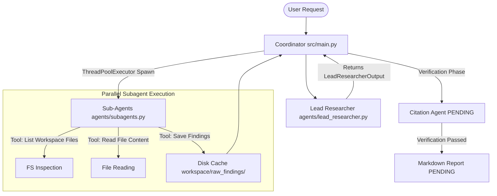

# Local Agent Researcher - Architecture

This project is a CLI-based local agent researcher designed to analyze local codebases, search documentation, and perform research tasks. It is built strictly following **Ollama Developer & Agent Guidelines (adapted from Karpathy's principles)** and orchestrated via **CrewAI**.

---

## Architectural Goals

1. **Simplicity First**: Minimal codebase, avoiding bloated abstractions.
2. **Context Preservation**: Leverage lightweight, focused subagents to keep individual agent contexts clean.
3. **Goal-Driven Concurrency**: Subagent research tasks are spawned and run in parallel using python threads, with raw findings cached to disk.
4. **State Persistence**: Track shared states in a unified Flow object and cache intermediate findings locally to support zero-waste retries.

---

## Folder Layout

```text
local_agent_reseracher/
├── agents/                  # CrewAI Agent Definitions
│   ├── __init__.py
│   ├── lead_researcher.py   # Step 1: Query planning agent
│   └── subagents.py         # Step 2: Surgical research specialist
├── docs/                    # Reorganized Project Documentation
│   ├── AGENTS.md            # CrewAI agent roles & prompts
│   ├── ARCHITECTURE.md      # Architectural design (this file)
│   ├── OLLAMA.md            # Local execution guidelines
│   ├── Untitled.png         # Flow chart diagram
│   ├── requirements.txt     # Python requirements list
│   └── implementation_plan.md # Roadmap & Progress log
├── src/                     # Core Orchestration Source Code
│   ├── __init__.py
│   ├── main.py              # Orchestrator entry point & ThreadPool loop
│   ├── state.py             # Pydantic ResearchState & Subtask schemas
│   └── tools.py             # Classless file manipulation and saving tools
├── tests/                   # Simplified Standalone Validation Runners
│   ├── test_lead_researcher.py # Runs Step 1 checks
│   └── test_subagents.py    # Runs Step 2 checks
└── workspace/               # Local cache & findings directory
    └── raw_findings/        # Cached text outputs from subagents (e.g. task_1.txt)
```

---

## Core Flow Architecture



### Concurrency Model
- **ThreadPoolExecutor**: Since subagent model generation calls are I/O bound, `ThreadPoolExecutor` is utilized inside [src/main.py](file:///Users/hargurjeetsinghganger/programming_local/local_agent_reseracher/src/main.py) to trigger Ollama requests concurrently. This enables the subagents to query, read, and write findings parallelly.

### Short-Term Memory Management
- **Context Isolation**: Subagents execute in isolated threads. They only see the specific target path and subtask details.
- **Payload Caps**: Read tools are capped at a maximum of 50KB to preserve model context limits and prevent parsing issues.
- **Disk Caching**: Subagents cache findings under `workspace/raw_findings/{task_id}.txt`, which downstream verification tasks consume.