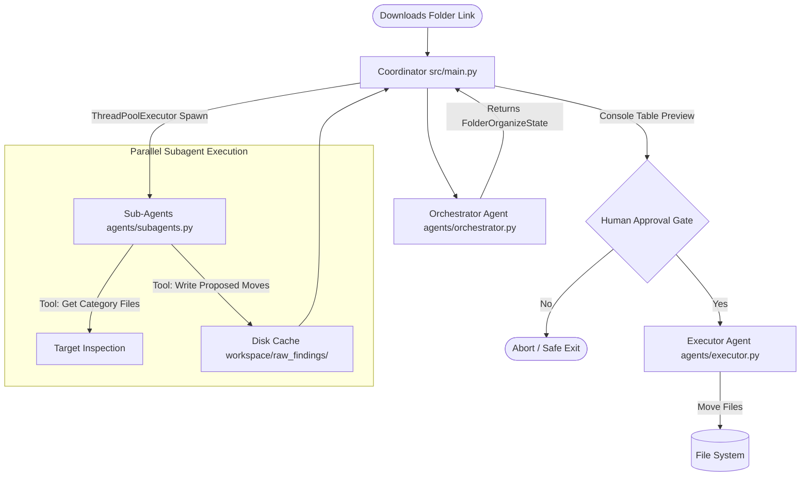

# Local Agent Organizer - Architecture

This document describes the design, concurrency flow, and architectural goals of the **Downloads Folder Organizer** agent system, which utilizes local Ollama models and CrewAI to semantically organize cluttered directories.

---

## Architectural Goals

1. **Semantic Classification over Extension Sorting**: Instead of basic extension-based sorting (e.g., all `.pdf` files to `Documents/`), the agents inspect filenames and metadata to classify files contextually (e.g., moving `tax_2025.pdf` to `Documents/Financial/` and `attention_paper.pdf` to `Documents/Learning/`).
2. **Context Budgets (Partitioned Execution)**: Large folders containing hundreds of files cannot be passed to a single LLM prompt due to context limits. The system uses a hierarchical division where lists are categorized first, and then analyzed by specialized subagents in isolated contexts.
3. **Local Concurrency**: Subagent tasks are executed in parallel threads using `ThreadPoolExecutor` to speed up processing on local Ollama configurations.
4. **Safety Gates (Human-in-the-Loop)**: Execution is non-destructive and transactional. No files are moved until the final consolidated plan is approved by the user via a terminal command line prompt.
5. **Repeatability & Recovery**: Every operation is logged to a `history.json` transaction log, enabling rollback support.

---

## Folder Layout

```text
local_agent_reseracher/
├── agents/                  # CrewAI Agent Definitions
│   ├── __init__.py
│   ├── orchestrator.py      # Scan directory & partition tasks
│   ├── subagents.py         # Category-specific semantic planning
│   └── executor.py          # Merges plans and performs file operations
├── docs/                    # Reorganized Project Documentation
│   ├── AGENTS.md            # Agent roles & prompts configuration
│   ├── ARCHITECTURE.md      # Architectural design (this file)
│   ├── OLLAMA.md            # Local execution guidelines
│   └── implementation_plan.md # Roadmap & Progress log
├── src/                     # Core Orchestration Source Code
│   ├── __init__.py
│   ├── main.py              # Orchestrator entry point & ThreadPool loop
│   ├── state.py             # Pydantic state schemas
│   └── tools.py             # Sandbox-isolated file movement tools
├── tests/                   # Standalone Validation & Sandbox Seeding
│   ├── conftest.py          # Sandbox folder creation & cleanup fixtures
│   ├── test_orchestrator.py # Runs Step 1 checks
│   └── test_subagents.py    # Runs Step 2 checks
└── workspace/               # Local cache & findings directory
    ├── raw_findings/        # Cache folders for subagent proposed mappings
    └── history.json         # Transaction log mapping source to destination
```

---

## Core Flow Architecture



### Concurrency Model
* **ThreadPoolExecutor**: Since subagent model prompts run concurrently, the orchestrator triggers them in parallel threads inside `src/main.py` to minimize total inference wait time.

### Short-Term Memory Management
* **State Structuring**: Track shared states in a unified `FolderOrganizeState` schema.
* **Disk Caching**: Subagents cache findings under `workspace/raw_findings/{category}_plan.json`, which the downstream aggregation step consumes. This provides a resilient boundary.